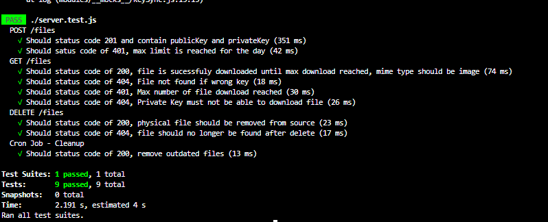

# **File Sharing**
File Sharing Simulation \
Upload, Delete and Download Files. \
.env Provided

### Install Packagists
`npm install` 

### Start Application 
`npm start` \
Should return \

Open browser and type http://localhost:3000 or click link below\
[File Sharing](http://localhost:3000/)
 

### RUN TEST SUITE 
`npm test` \
Should return \
